# Execution Plan

## Detailed Analysis Summary

### Project Type
- **Type**: Greenfield (신규 프로젝트)
- **Complexity**: High
- **Primary Changes**: 완전히 새로운 테이블 오더 시스템 구축

### Change Impact Assessment

**User-facing changes**: Yes
- 고객용 주문 인터페이스 (웹 UI)
- 관리자용 운영 인터페이스 (웹 UI)
- 실시간 주문 업데이트

**Structural changes**: Yes
- 새로운 시스템 아키텍처 설계
- 멀티 테넌트 구조
- 클라이언트-서버 아키텍처

**Data model changes**: Yes
- Store, Table, TableSession, Menu, Category, Order, OrderItem, OrderHistory 엔티티
- 관계형 데이터베이스 스키마 설계

**API changes**: Yes
- RESTful API 엔드포인트 설계
- SSE 실시간 통신 엔드포인트
- 인증 API (JWT)

**NFR impact**: Yes
- 실시간 성능 (2초 이내 업데이트)
- 멀티 테넌트 데이터 격리
- 캐싱 전략 (메뉴 + 정적 데이터)
- 보안 (JWT, bcrypt, 데이터 격리)

### Risk Assessment
- **Risk Level**: Medium
- **Rationale**: 
  - 신규 프로젝트로 기존 시스템 영향 없음
  - 실시간 통신 및 멀티 테넌트 구현 복잡도
  - 명확한 요구사항과 User Stories로 리스크 완화
- **Rollback Complexity**: Easy (신규 프로젝트)
- **Testing Complexity**: Moderate (단위 + 통합 + E2E 테스트 필요)

---

## Workflow Visualization

```mermaid
flowchart TD
    Start(["User Request"])
    
    subgraph INCEPTION["🔵 INCEPTION PHASE"]
        WD["Workspace Detection<br/><b>COMPLETED</b>"]
        RE["Reverse Engineering<br/><b>SKIPPED</b>"]
        RA["Requirements Analysis<br/><b>COMPLETED</b>"]
        US["User Stories<br/><b>COMPLETED</b>"]
        WP["Workflow Planning<br/><b>IN PROGRESS</b>"]
        AD["Application Design<br/><b>EXECUTE</b>"]
        UG["Units Generation<br/><b>EXECUTE</b>"]
    end
    
    subgraph CONSTRUCTION["🟢 CONSTRUCTION PHASE"]
        FD["Functional Design<br/><b>EXECUTE</b>"]
        NFRA["NFR Requirements<br/><b>EXECUTE</b>"]
        NFRD["NFR Design<br/><b>EXECUTE</b>"]
        ID["Infrastructure Design<br/><b>EXECUTE</b>"]
        CG["Code Generation<br/><b>EXECUTE</b>"]
        BT["Build and Test<br/><b>EXECUTE</b>"]
    end
    
    subgraph OPERATIONS["🟡 OPERATIONS PHASE"]
        OPS["Operations<br/><b>PLACEHOLDER</b>"]
    end
    
    Start --> WD
    WD --> RA
    RA --> US
    US --> WP
    WP --> AD
    AD --> UG
    UG --> FD
    FD --> NFRA
    NFRA --> NFRD
    NFRD --> ID
    ID --> CG
    CG --> BT
    BT --> OPS
    OPS --> End(["Complete"])
    
    style WD fill:#4CAF50,stroke:#1B5E20,stroke-width:3px,color:#fff
    style RA fill:#4CAF50,stroke:#1B5E20,stroke-width:3px,color:#fff
    style US fill:#4CAF50,stroke:#1B5E20,stroke-width:3px,color:#fff
    style WP fill:#4CAF50,stroke:#1B5E20,stroke-width:3px,color:#fff
    style RE fill:#BDBDBD,stroke:#424242,stroke-width:2px,stroke-dasharray: 5 5,color:#000
    style AD fill:#FFA726,stroke:#E65100,stroke-width:3px,stroke-dasharray: 5 5,color:#000
    style UG fill:#FFA726,stroke:#E65100,stroke-width:3px,stroke-dasharray: 5 5,color:#000
    style FD fill:#FFA726,stroke:#E65100,stroke-width:3px,stroke-dasharray: 5 5,color:#000
    style NFRA fill:#FFA726,stroke:#E65100,stroke-width:3px,stroke-dasharray: 5 5,color:#000
    style NFRD fill:#FFA726,stroke:#E65100,stroke-width:3px,stroke-dasharray: 5 5,color:#000
    style ID fill:#FFA726,stroke:#E65100,stroke-width:3px,stroke-dasharray: 5 5,color:#000
    style CG fill:#FFA726,stroke:#E65100,stroke-width:3px,stroke-dasharray: 5 5,color:#000
    style BT fill:#FFA726,stroke:#E65100,stroke-width:3px,stroke-dasharray: 5 5,color:#000
    style OPS fill:#BDBDBD,stroke:#424242,stroke-width:2px,stroke-dasharray: 5 5,color:#000
    style INCEPTION fill:#BBDEFB,stroke:#1565C0,stroke-width:3px,color:#000
    style CONSTRUCTION fill:#C8E6C9,stroke:#2E7D32,stroke-width:3px,color:#000
    style OPERATIONS fill:#FFF59D,stroke:#F57F17,stroke-width:3px,color:#000
    style Start fill:#CE93D8,stroke:#6A1B9A,stroke-width:3px,color:#000
    style End fill:#CE93D8,stroke:#6A1B9A,stroke-width:3px,color:#000
    
    linkStyle default stroke:#333,stroke-width:2px
```

---

## Phases to Execute

### 🔵 INCEPTION PHASE

- [x] **Workspace Detection** - COMPLETED
  - Greenfield 프로젝트 확인
  
- [x] **Reverse Engineering** - SKIPPED
  - 신규 프로젝트로 기존 코드 없음

- [x] **Requirements Analysis** - COMPLETED
  - 상세 요구사항 문서 작성
  - 기술 스택 결정
  - 19개 명확화 질문 답변

- [x] **User Stories** - COMPLETED
  - 2개 페르소나 생성
  - 25개 User Stories 생성 (모두 MVP)
  - Given-When-Then 수용 기준

- [x] **Workflow Planning** - IN PROGRESS
  - 실행 계획 수립

- [ ] **Application Design** - EXECUTE
  - **Rationale**: 
    - 새로운 컴포넌트 및 서비스 필요 (고객 UI, 관리자 UI, 백엔드 API)
    - 서비스 레이어 설계 필요 (주문 서비스, 메뉴 서비스, 테이블 서비스 등)
    - 컴포넌트 간 의존성 및 통신 방식 명확화
    - 비즈니스 로직 계층 구조 정의

- [ ] **Units Generation** - EXECUTE
  - **Rationale**:
    - 복잡한 시스템을 병렬 개발 가능한 단위로 분해
    - 고객 기능 / 관리자 기능 / 공통 기능 분리
    - 프론트엔드 2개 + 백엔드 API + 데이터베이스 스키마
    - 팀 협업 및 작업 분배 용이

### 🟢 CONSTRUCTION PHASE

- [ ] **Functional Design** - EXECUTE (Per-Unit)
  - **Rationale**:
    - 새로운 데이터 모델 설계 (8개 엔티티)
    - 복잡한 비즈니스 로직 (세션 관리, 주문 워크플로우, 상태 전환)
    - API 엔드포인트 상세 설계
    - 데이터베이스 스키마 및 관계 정의

- [ ] **NFR Requirements** - EXECUTE (Per-Unit)
  - **Rationale**:
    - 실시간 통신 요구사항 (SSE, 2초 이내 업데이트)
    - 멀티 테넌트 데이터 격리
    - 성능 요구사항 (캐싱 전략)
    - 보안 요구사항 (JWT, bcrypt, 세션 관리)

- [ ] **NFR Design** - EXECUTE (Per-Unit)
  - **Rationale**:
    - SSE 하이브리드 방식 구현 설계
    - 멀티 테넌트 데이터 격리 패턴
    - 캐싱 레이어 설계 (메뉴 + 정적 데이터)
    - JWT 인증 플로우 설계

- [ ] **Infrastructure Design** - EXECUTE (Per-Unit)
  - **Rationale**:
    - PostgreSQL 데이터베이스 스키마
    - FastAPI 서버 구조
    - React 애플리케이션 구조
    - 환경 변수 및 설정 관리

- [ ] **Code Generation** - EXECUTE (Per-Unit, ALWAYS)
  - **Rationale**: 실제 코드 구현 필요

- [ ] **Build and Test** - EXECUTE (ALWAYS)
  - **Rationale**: 
    - 단위 테스트
    - 통합 테스트
    - E2E 테스트
    - 빌드 및 실행 검증

### 🟡 OPERATIONS PHASE

- [ ] **Operations** - PLACEHOLDER
  - **Rationale**: 향후 배포 및 모니터링 워크플로우 확장 예정

---

## Estimated Timeline

- **Total Phases to Execute**: 11 stages
- **INCEPTION**: 2 stages (Application Design, Units Generation)
- **CONSTRUCTION**: 6 stages per unit (Functional Design, NFR Requirements, NFR Design, Infrastructure Design, Code Generation, Build and Test)
- **Estimated Duration**: 
  - Application Design: 1 session
  - Units Generation: 1 session
  - Per-Unit Construction: 1-2 sessions per unit
  - Build and Test: 1 session

---

## Success Criteria

**Primary Goal**: 
- 완전히 동작하는 테이블 오더 MVP 시스템 구축

**Key Deliverables**:
- 고객용 주문 인터페이스 (React)
- 관리자용 운영 인터페이스 (React)
- 백엔드 API 서버 (FastAPI)
- PostgreSQL 데이터베이스 스키마
- 실시간 주문 모니터링 (SSE)
- 멀티 테넌트 지원
- 전체 테스트 스위트 (단위 + 통합 + E2E)

**Quality Gates**:
- 모든 User Stories의 수용 기준 충족
- 실시간 업데이트 성능 (2초 이내)
- 멀티 테넌트 데이터 격리 검증
- 전체 테스트 통과
- 빌드 및 로컬 실행 성공
